# eWPTXv2

```mermaid
mindmap
  root)**eWPTXv2** 👺(
    Resources 🤓
        https://my.ine.com/CyberSecurity/courses/630a470a/web-application-penetration-testing-extreme
        https://www.youtube.com/watch?v=xQ2rivaFcsE
        https://www.youtube.com/watch?v=UfILDa_qStQ
        https://www.youtube.com/watch?v=x_vPhmvsTOc
        https://portswigger.net/support/sql-injection-in-different-statement-types?source=post_page-----a741220cf145--------------------------------
    Labs 👾
        SSRF
            https://portswigger.net/web-security/all-labs#server-side-request-forgery-ssrf
        XSS
            https://portswigger.net/web-security/all-labs#cross-site-scripting
        SQLi
            https://portswigger.net/web-security/all-labs#sql-injection
        XXE
            https://portswigger.net/web-security/all-labs#xml-external-entity-xxe-injection
        SSTI
            https://portswigger.net/web-security/all-labs#server-side-template-injection
        Insecure deserialization
            https://portswigger.net/web-security/all-labs#insecure-deserialization
        CSRF
            https://portswigger.net/web-security/all-labs#cross-site-request-forgery-csrf
        Authentication vulnerabilities
            https://portswigger.net/web-security/all-labs#authentication

    Tools 🤓
        https://github.com/xmendez/wfuzz
        https://github.com/frohoff/ysoserial
        https://github.com/sqlmapproject/sqlmap
        https://github.com/pentestmonkey/php-reverse-shell/blob/master/php-reverse-shell.php
        https://onlinephp.io/
        https://portswigger.net/web-security/cross-site-scripting/cheat-sheet

```

### Resources
- [Web Application Penetration Testing Extreme](https://my.ine.com/CyberSecurity/courses/630a470a/web-application-penetration-testing-extreme)
- [YouTube Video 1](https://www.youtube.com/watch?v=xQ2rivaFcsE)
- [YouTube Video 2](https://www.youtube.com/watch?v=UfILDa_qStQ)
- [YouTube Video 3](https://www.youtube.com/watch?v=x_vPhmvsTOc)
- [SQL Injection in Different Statement Types](https://portswigger.net/support/sql-injection-in-different-statement-types?source=post_page-----a741220cf145--------------------------------)

### Labs
- [Server-side request forgery (SSRF)](https://portswigger.net/web-security/all-labs#server-side-request-forgery-ssrf)
- [Cross-site scripting (XSS)](https://portswigger.net/web-security/all-labs#cross-site-scripting)
- [SQL Injection (SQLi)](https://portswigger.net/web-security/all-labs#sql-injection)
- [XXE & XXE Blind](https://portswigger.net/web-security/all-labs#xml-external-entity-xxe-injection)
- [Server-side template injection (SSTI)](https://portswigger.net/web-security/all-labs#server-side-template-injection)
- [Insecure deserialization](https://portswigger.net/web-security/all-labs#insecure-deserialization)
- [Cross-site request forgery (CSRF)](https://portswigger.net/web-security/all-labs#cross-site-request-forgery-csrf)
- [Authentication vulnerabilities](https://portswigger.net/web-security/all-labs#authentication)

### Tools
- [Wfuzz](https://github.com/xmendez/wfuzz)
- [ysoserial](https://github.com/frohoff/ysoserial)
- [SQLMap](https://github.com/sqlmapproject/sqlmap)
- [PHP Reverse Shell](https://github.com/pentestmonkey/php-reverse-shell/blob/master/php-reverse-shell.php)
- [Online PHP Editor](https://onlinephp.io/)
- [XSS Cheat Sheet](https://portswigger.net/web-security/cross-site-scripting/cheat-sheet)
