# eWPTXv2

```mermaid
mindmap
  root)**eWPTXv2** 👺(
    Resources 🤓
        https://my.ine.com/CyberSecurity/courses/630a470a/web-application-penetration-testing-extreme
        https://www.youtube.com/watch?v=xQ2rivaFcsE
        https://www.youtube.com/watch?v=UfILDa_qStQ
        https://www.youtube.com/watch?v=x_vPhmvsTOc
        https://portswigger.net/support/sql-injection-in-different-statement-types?source=post_page-----a741220cf145--------------------------------
    Labs 👾
        SSRF
            https://portswigger.net/web-security/all-labs#server-side-request-forgery-ssrf
        XSS
            https://portswigger.net/web-security/all-labs#cross-site-scripting
        SQLi
            https://portswigger.net/web-security/all-labs#sql-injection
        XXE
            https://portswigger.net/web-security/all-labs#xml-external-entity-xxe-injection
        SSTI
            https://portswigger.net/web-security/all-labs#server-side-template-injection
        Insecure deserialization
            https://portswigger.net/web-security/all-labs#insecure-deserialization
        CSRF
            https://portswigger.net/web-security/all-labs#cross-site-request-forgery-csrf
        Authentication vulnerabilities
            https://portswigger.net/web-security/all-labs#authentication

    Tools 🤓
        https://github.com/xmendez/wfuzz
        https://github.com/frohoff/ysoserial
        https://github.com/sqlmapproject/sqlmap
        https://github.com/pentestmonkey/php-reverse-shell/blob/master/php-reverse-shell.php
        https://onlinephp.io/
        https://portswigger.net/web-security/cross-site-scripting/cheat-sheet

```

tt
Resources
https://my.ine.com/CyberSecurity/courses/630a470a/web-application-penetration-testing-extreme
https://www.youtube.com/watch?v=xQ2rivaFcsE
https://www.youtube.com/watch?v=UfILDa_qStQ
https://www.youtube.com/watch?v=x_vPhmvsTOc
https://portswigger.net/support/sql-injection-in-different-statement-types?source=post_page-----a741220cf145--------------------------------
Labs
Server-side request forgery (SSRF)
https://portswigger.net/web-security/all-labs#server-side-request-forgery-ssrf
Cross-site scripting (XSS)
https://portswigger.net/web-security/all-labs#cross-site-scripting
SQLi
https://portswigger.net/web-security/all-labs#sql-injection
XXE & XXE Blind
https://portswigger.net/web-security/all-labs#xml-external-entity-xxe-injection
SSTI
https://portswigger.net/web-security/all-labs#server-side-template-injection
Insecure deserialization
https://portswigger.net/web-security/all-labs#insecure-deserialization
Cross-site request forgery (CSRF)
https://portswigger.net/web-security/all-labs#cross-site-request-forgery-csrf
Authentication vulnerabilities
https://portswigger.net/web-security/all-labs#authentication
Tools
https://github.com/xmendez/wfuzz
https://github.com/frohoff/ysoserial
https://github.com/sqlmapproject/sqlmap
https://github.com/pentestmonkey/php-reverse-shell/blob/master/php-reverse-shell.php
https://onlinephp.io/
https://portswigger.net/web-security/cross-site-scripting/cheat-sheet
